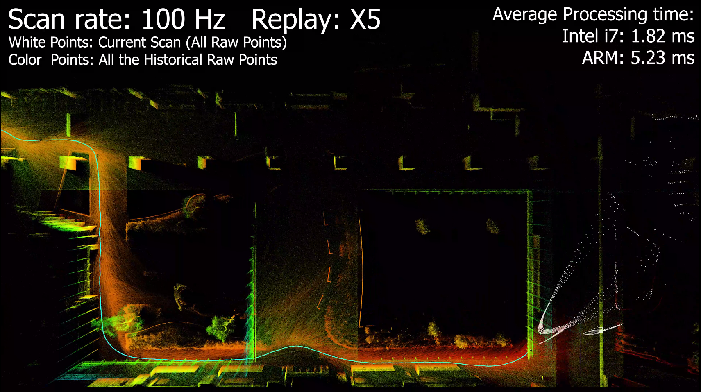
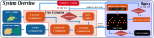
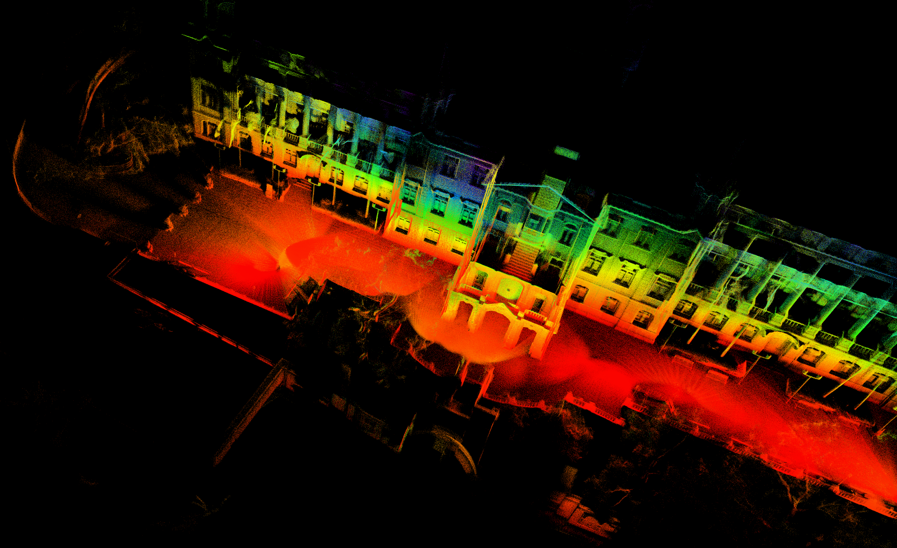
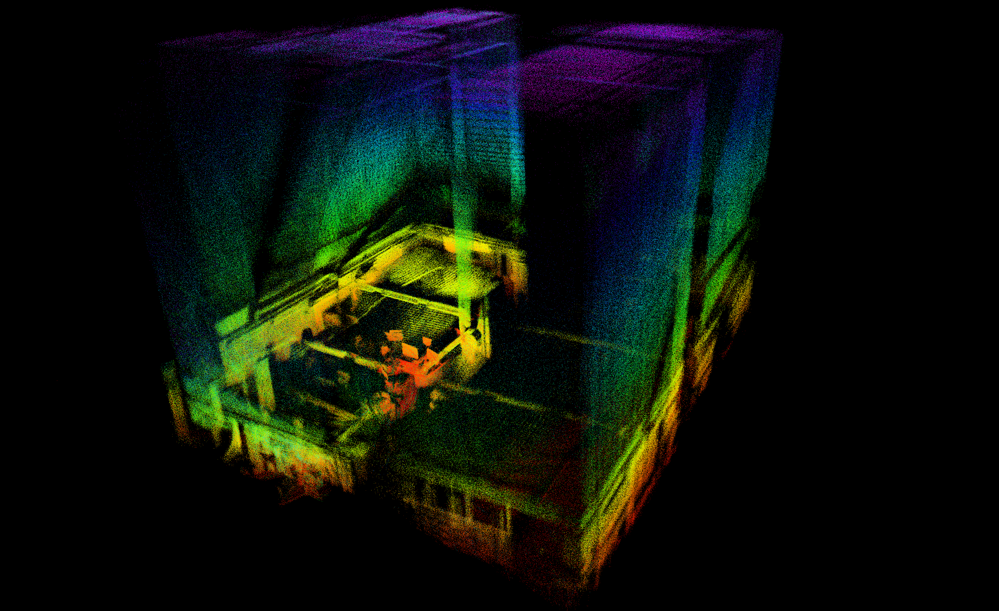
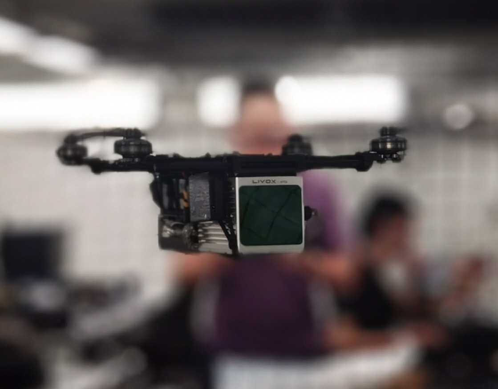
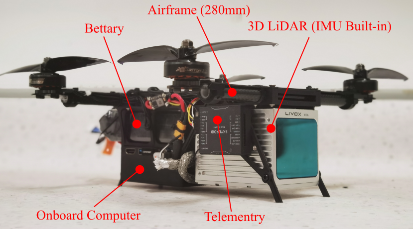

> ROS2 Fork repo maintainer: [Ericsiii](https://github.com/Ericsii)

## Related Works and Extended Application

**SLAM:**

1. [ikd-Tree](https://github.com/hku-mars/ikd-Tree): A state-of-art dynamic KD-Tree for 3D kNN search.
2. [R2LIVE](https://github.com/hku-mars/r2live): A high-precision LiDAR-inertial-Vision fusion work using FAST-LIO as LiDAR-inertial front-end.
3. [LI_Init](https://github.com/hku-mars/LiDAR_IMU_Init): A robust, real-time LiDAR-IMU extrinsic initialization and synchronization package..
4. [FAST-LIO-LOCALIZATION](https://github.com/HViktorTsoi/FAST_LIO_LOCALIZATION): The integration of FAST-LIO with **Re-localization** function module.

**Control and Plan:**

1. [IKFOM](https://github.com/hku-mars/IKFoM): A Toolbox for fast and high-precision on-manifold Kalman filter.
2. [UAV Avoiding Dynamic Obstacles](https://github.com/hku-mars/dyn_small_obs_avoidance): One of the implementation of FAST-LIO in robot's planning.
3. [UGV Demo](https://www.youtube.com/watch?v=wikgrQbE6Cs): Model Predictive Control for Trajectory Tracking on Differentiable Manifolds.
4. [Bubble Planner](https://arxiv.org/abs/2202.12177): Planning High-speed Smooth Quadrotor Trajectories using Receding Corridors.

<!-- 10. [**FAST-LIVO**](https://github.com/hku-mars/FAST-LIVO): Fast and Tightly-coupled Sparse-Direct LiDAR-Inertial-Visual Odometry. -->

## FAST-LIO
**FAST-LIO** (Fast LiDAR-Inertial Odometry) is a computationally efficient and robust LiDAR-inertial odometry package. It fuses LiDAR feature points with IMU data using a tightly-coupled iterated extended Kalman filter to allow robust navigation in fast-motion, noisy or cluttered environments where degeneration occurs. Our package address many key issues:
1. Fast iterated Kalman filter for odometry optimization;
2. Automaticaly initialized at most steady environments;
3. Parallel KD-Tree Search to decrease the computation;

## FAST-LIO 2.0 (2021-07-05 Update)
<!--  -->
<!-- [](https://youtu.be/2OvjGnxszf8) -->
<div align="left">


</div>

**Related video:**  [FAST-LIO2](https://youtu.be/2OvjGnxszf8),  [FAST-LIO1](https://youtu.be/iYCY6T79oNU)

**Pipeline:**
<div align="center">

</div>

**New Features:**
1. Incremental mapping using [ikd-Tree](https://github.com/hku-mars/ikd-Tree), achieve faster speed and over 100Hz LiDAR rate.
2. Direct odometry (scan to map) on Raw LiDAR points (feature extraction can be disabled), achieving better accuracy.
3. Since no requirements for feature extraction, FAST-LIO2 can support many types of LiDAR including spinning (Velodyne, Ouster) and solid-state (Livox Avia, Horizon, MID-70) LiDARs, and can be easily extended to support more LiDARs.
4. Support external IMU.
5. Support ARM-based platforms including Khadas VIM3, Nivida TX2, Raspberry Pi 4B(8G RAM).

**Related papers**: 

[FAST-LIO2: Fast Direct LiDAR-inertial Odometry](doc/Fast_LIO_2.pdf)

[FAST-LIO: A Fast, Robust LiDAR-inertial Odometry Package by Tightly-Coupled Iterated Kalman Filter](https://arxiv.org/abs/2010.08196)

**Contributors**

[Wei Xu 徐威](https://github.com/XW-HKU)，[Yixi Cai 蔡逸熙](https://github.com/Ecstasy-EC)，[Dongjiao He 贺东娇](https://github.com/Joanna-HE)，[Fangcheng Zhu 朱方程](https://github.com/zfc-zfc)，[Jiarong Lin 林家荣](https://github.com/ziv-lin)，[Zheng Liu 刘政](https://github.com/Zale-Liu), [Borong Yuan](https://github.com/borongyuan)

<!-- <div align="center">
    
    
</div> -->

## 1. Prerequisites
### 1.1 **Ubuntu** and **ROS**
**Ubuntu >= 20.04**

The **default from apt** PCL and Eigen is enough for FAST-LIO to work normally.

ROS >= Foxy (Recommend to use ROS-Humble). [ROS Installation](https://docs.ros.org/en/humble/Installation.html)

### 1.2. **PCL && Eigen**
PCL    >= 1.8,   Follow [PCL Installation](https://pointclouds.org/downloads/#linux).

Eigen  >= 3.3.4, Follow [Eigen Installation](http://eigen.tuxfamily.org/index.php?title=Main_Page).

### <span id="1.3">1.3. **livox_ros_driver2**</span>
Follow [livox_ros_driver2 Installation](https://github.com/Livox-SDK/livox_ros_driver2).

You can also use the one I modified [livox_ros_driver2](https://github.com/Ericsii/livox_ros_driver2/tree/feature/use-standard-unit)

*Remarks:*
- Since the FAST-LIO must support Livox serials LiDAR firstly, so the **livox_ros_driver** must be installed and **sourced** before run any FAST-LIO launch file.
- How to source? The easiest way is add the line ``` source $Licox_ros_driver_dir$/devel/setup.bash ``` to the end of file ``` ~/.bashrc ```, where ``` $Licox_ros_driver_dir$ ``` is the directory of the livox ros driver workspace (should be the ``` ws_livox ``` directory if you completely followed the livox official document).


## 2. Build
Clone the repository and colcon build:

```bash
    cd <ros2_ws>/src # cd into a ros2 workspace folder
    git clone https://github.com/Ericsii/FAST_LIO.git --recursive
    cd ..
    rosdep install --from-paths src --ignore-src -y
    colcon build --symlink-install
    . ./install/setup.bash # use setup.zsh if use zsh
```
- **Remember to source the livox_ros_driver before build (follow [1.3 livox_ros_driver](#1.3))**
- If you want to use a custom build of PCL, add the following line to ~/.bashrc
```export PCL_ROOT={CUSTOM_PCL_PATH}```
## 3. Directly run
Noted:

A. Please make sure the IMU and LiDAR are **Synchronized**, that's important.

B. The warning message "Failed to find match for field 'time'." means the timestamps of each LiDAR points are missed in the rosbag file. That is important for the forward propagation and backwark propagation.

C. We recommend to set the **extrinsic_est_en** to false if the extrinsic is give. As for the extrinsic initiallization, please refer to our recent work: [**Robust Real-time LiDAR-inertial Initialization**](https://github.com/hku-mars/LiDAR_IMU_Init).

### 3.1 Run use ros launch
Connect to your PC to Livox LiDAR by following  [Livox-ros-driver2 installation](https://github.com/Livox-SDK/livox_ros_driver2), then
```bash
cd <ros2_ws>
. install/setup.bash # use setup.zsh if use zsh
ros2 launch fast_lio mapping.launch.py config_file:=avia.yaml
```

Change `config_file` parameter to other yaml file under config directory as you need.

Launch livox ros driver. Use MID360 as an example.

```bash
ros2 launch livox_ros_driver2 msg_MID360_launch.py
```

- For livox serials, FAST-LIO only support the data collected by the ``` livox_lidar_msg.launch ``` since only its ``` livox_ros_driver2/CustomMsg ``` data structure produces the timestamp of each LiDAR point which is very important for the motion undistortion. ``` livox_lidar.launch ``` can not produce it right now.
- If you want to change the frame rate, please modify the **publish_freq** parameter in the [livox_lidar_msg.launch](https://github.com/Livox-SDK/livox_ros_driver/blob/master/livox_ros_driver2/launch/livox_lidar_msg.launch) of [Livox-ros-driver](https://github.com/Livox-SDK/livox_ros_driver2) before make the livox_ros_driver pakage.

### 3.2 For Livox serials with external IMU

mapping_avia.launch theratically supports mid-70, mid-40 or other livox serial LiDAR, but need to setup some parameters befor run:

Edit ``` config/avia.yaml ``` to set the below parameters:

1. LiDAR point cloud topic name: ``` lid_topic ```
2. IMU topic name: ``` imu_topic ```
3. Translational extrinsic: ``` extrinsic_T ```
4. Rotational extrinsic: ``` extrinsic_R ``` (only support rotation matrix)
- The extrinsic parameters in FAST-LIO is defined as the LiDAR's pose (position and rotation matrix) in IMU body frame (i.e. the IMU is the base frame). They can be found in the official manual.
- FAST-LIO produces a very simple software time sync for livox LiDAR, set parameter ```time_sync_en``` to ture to turn on. But turn on **ONLY IF external time synchronization is really not possible**, since the software time sync cannot make sure accuracy.

### 3.4 PCD file save

Set ``` pcd_save_enable ``` in launchfile to ``` 1 ```. All the scans (in global frame) will be accumulated and saved to the file ``` FAST_LIO/PCD/scans.pcd ``` after the FAST-LIO is terminated. ```pcl_viewer scans.pcd``` can visualize the point clouds.

*Tips for pcl_viewer:*
- change what to visualize/color by pressing keyboard 1,2,3,4,5 when pcl_viewer is running. 
```
    1 is all random
    2 is X values
    3 is Y values
    4 is Z values
    5 is intensity
```

## 4. Rosbag Example
### 4.1 Livox Avia Rosbag
<div align="left">



Files: Can be downloaded from [google drive](https://drive.google.com/drive/folders/1CGYEJ9-wWjr8INyan6q1BZz_5VtGB-fP?usp=sharing)**!!!This ros1 bag should be convert to ros2!!!**

Run:
```bash
ros2 launch fast_lio mapping.launch.py config_path:=<path_to_your_config_file>
ros2 bag play <your_bag_dir>

```

### 4.2 Velodyne HDL-32E Rosbag

**NCLT Dataset**: Original bin file can be found [here](http://robots.engin.umich.edu/nclt/).

We produce [Rosbag Files](https://drive.google.com/drive/folders/1VBK5idI1oyW0GC_I_Hxh63aqam3nocNK?usp=sharing) and [a python script](https://drive.google.com/file/d/1leh7DxbHx29DyS1NJkvEfeNJoccxH7XM/view) to generate Rosbag files: ```python3 sensordata_to_rosbag_fastlio.py bin_file_dir bag_name.bag```**!!!This ros1 bag should be convert to ros2!!!** To convert ros1 bag to ros2 bag, please follow the documentation [Convert rosbag versions](https://ternaris.gitlab.io/rosbags/topics/convert.html)
    
Run:
```
roslaunch fast_lio mapping_velodyne.launch
rosbag play YOUR_DOWNLOADED.bag
```

## 5.Implementation on UAV
In order to validate the robustness and computational efficiency of FAST-LIO in actual mobile robots, we build a small-scale quadrotor which can carry a Livox Avia LiDAR with 70 degree FoV and a DJI Manifold 2-C onboard computer with a 1.8 GHz Intel i7-8550U CPU and 8 G RAM, as shown in below.

The main structure of this UAV is 3d printed (Aluminum or PLA), the .stl file will be open-sourced in the future.

<div align="center">
    
    
</div>

## 6.Acknowledgments

Thanks for LOAM(J. Zhang and S. Singh. LOAM: Lidar Odometry and Mapping in Real-time), [Livox_Mapping](https://github.com/Livox-SDK/livox_mapping), [LINS](https://github.com/ChaoqinRobotics/LINS---LiDAR-inertial-SLAM) and [Loam_Livox](https://github.com/hku-mars/loam_livox).
